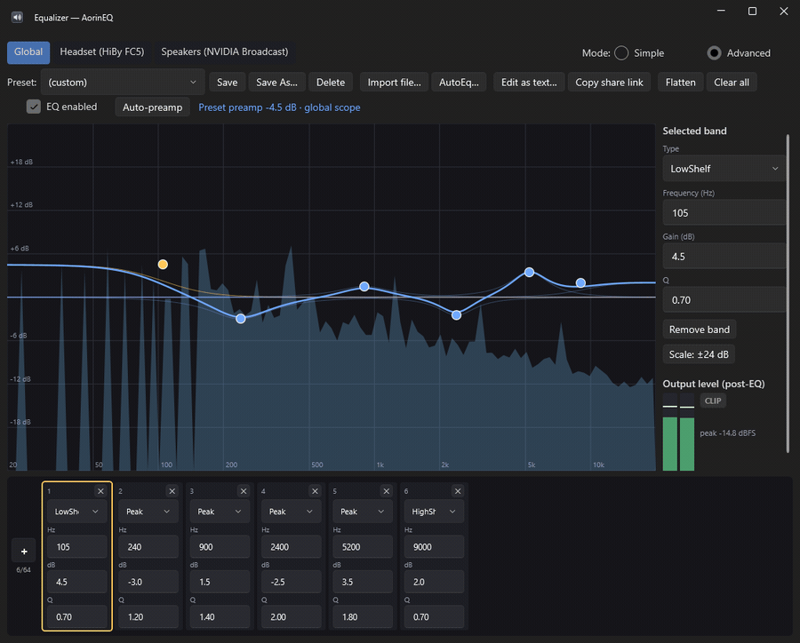
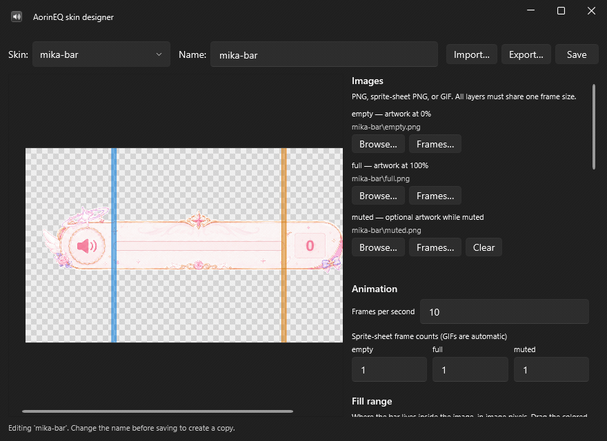

<p align="center">
  
</p>

<h1 align="center">AorinEQ</h1>

<h4 align="center">Working volume keys, a skin you draw yourself, and a real parametric EQ — one small tray app for Windows.</h4>

<p align="center">
  <a href="https://github.com/weejiaquan/aorineq/releases/latest">
    
  </a>
  <a href="https://github.com/weejiaquan/aorineq/releases">
    
  </a>
  
  <a href="LICENSE">
    
  </a>
  <a href="https://aorineq-web.vercel.app">
    
  </a>
</p>

<p align="center">
  <a href="#key-features">Key Features</a> •
  <a href="#how-to-use">How To Use</a> •
  <a href="#download">Download</a> •
  <a href="#docs">Docs</a> •
  <a href="#credits">Credits</a> •
  <a href="#license">License</a>
</p>

<p align="center">
  
</p>

## Key Features

* **Two volume modes**
  - *Replace Windows volume* — the keys drive the real Windows level, you just get a nicer OSD.
  - *Equalizer APO preamp* — digital attenuation before the audio reaches the device, for USB
    DACs that ignore Windows volume entirely (the slider moves, nothing changes).
* **A volume per playback device** — follows the Windows default device, remembers where you left
  each one, and switches silently.
* **A fully skinnable OSD** — PNG, GIF or sprite-sheet artwork, an optional muted layer, per-pixel
  click-through, and click / drag / scroll on the artwork to set the level.
* **Percent text you actually style** — font, size, colour, bold, outline, shadow, and left /
  centre / right alignment, anywhere on the image.
* **Per-skin fill range** — point 0 % and 100 % at the bar inside a wide decorative image, so the
  fill and the clicks land on the right pixels.
* **A skin designer** — build one without hand-editing a thing: pick the layers, scrub the fill,
  drag the number, test it on your desktop, export a zip.
* **Parametric EQ** — a draggable curve over a live post-EQ spectrum, up to 64 bands, six filter
  types, auto-preamp, per-band typed columns, bulk paste-as-text, and output meters with clip
  detection.
* **Global and per-device EQ** — one chain per playback device, plus a global one on top.
* **Simple or Advanced** — three sliders when that is all you want, the whole editor when it
  isn't. Same bands underneath.
* **Presets and AutoEq** — presets are plain Equalizer APO `.txt` files, and AutoEq profiles
  import byte-for-byte, straight from its published index.
* **`aorineq://` links** — one click installs a skin or applies an EQ preset from a web page,
  always behind a dialog that shows you what it is first.
* **Auto-update** — checks GitHub Releases, verifies the SHA-256, swaps itself in place.
* **Windows 11 Fluent UI** — Mica, rounded corners, follows your light/dark theme, and a tray
  icon drawn at runtime that tracks your volume.

<p align="center">
  
  <br>
  <em>Drag a node; the curve, the band strip and the config file follow.</em>
</p>

<p align="center">
  
  <br>
  <em>The skin designer: scrub the fill, preview mute, style the number.</em>
</p>

## How To Use

1. **Install and run it.** On first launch AorinEQ asks which volume mode you want, and — if you
   pick the Equalizer APO one and don't have it yet — walks you through installing
   [Equalizer APO](https://equalizerapo.com) from its own home.
2. **Press a volume key.** Volume Up / Down / Mute now belong to AorinEQ, 2 % a press. The OSD
   appears; you can click, drag and scroll it too.
3. **Make it yours.** Tray → *Settings…* for the style, position and behaviour, or
   *Skin designer…* to draw your own. Grab one from the
   [skin gallery](https://aorineq-web.vercel.app/gallery) to start from.
4. **Open the equalizer.** Tray → *Open equalizer…*. Start in Simple mode, or go Advanced and
   drag the curve. Import an [AutoEq](https://github.com/jaakkopasanen/AutoEq) profile for your
   headphones in two clicks.

> **Using an Equalizer APO preamp for volume?** Set your DAC's physical volume to your maximum
> comfortable loudness once — from then on the keyboard works digitally below that ceiling.

## Download

**[⬇ AorinEQ-Setup.exe](https://github.com/weejiaquan/aorineq/releases/latest/download/AorinEQ-Setup.exe)** — recommended.

Installs for the current user into `%LOCALAPPDATA%\Programs\AorinEQ`, so there is **no UAC
prompt**, and it shows up in the Start Menu and in Apps & Features like any other app. It does not
add itself to Windows startup (that stays a Settings toggle) and it does not touch your Equalizer
APO config.

**[⬇ AorinEQ.exe](https://github.com/weejiaquan/aorineq/releases/latest/download/AorinEQ.exe)** — portable.

The same build as a single file. Run it from anywhere; nothing is installed. In-app updates work
either way, because both locations are writable without elevation.

<details>
<summary><b>Windows will warn you — here's how to check it yourself</b></summary>

<br>

AorinEQ isn't code-signed (a certificate costs more than this project makes, which is nothing), so
SmartScreen shows **"Windows protected your PC"**. That is Windows saying *this file is not
common yet*, not that it found anything. You can run it anyway with **More info → Run anyway**, or
verify the bytes first — every release ships a `.sha256` sidecar:

```powershell
(Get-FileHash .\AorinEQ-Setup.exe).Hash -eq
  (irm https://github.com/weejiaquan/aorineq/releases/latest/download/AorinEQ-Setup.exe.sha256).Split(' ')[0]
```

`True` means the file is exactly what was published. The portable exe has its own
[`AorinEQ.exe.sha256`](https://github.com/weejiaquan/aorineq/releases/latest/download/AorinEQ.exe.sha256).

</details>

<details>
<summary><b>Build it from source instead</b></summary>

<br>

Needs the .NET 8 SDK, and [Inno Setup 6](https://jrsoftware.org/isinfo.php)
(`winget install --id JRSoftware.InnoSetup`) for the installer step:

```powershell
git clone https://github.com/weejiaquan/aorineq.git
cd aorineq
powershell -File publish.ps1     # all four release files land in publish\
```

Runs on Windows 10/11 x64. Releases are self-contained: no .NET runtime needed to use them.

</details>

## Docs

- **[Skin gallery](https://aorineq-web.vercel.app/gallery)** — browse skins, install with one
  click.
- **[Link builder](https://aorineq-web.vercel.app/tools/skin-link)** and
  **[EQ preset links](https://aorineq-web.vercel.app/tools/eq-preset)** — share what you made.
- **[aorineq-web.vercel.app/docs](https://aorineq-web.vercel.app/docs)** — install guide, skin
  format, and the `aorineq://` contract.
- **[docs/reference.md](docs/reference.md)** — the full manual in this repo: volume modes, the
  whole `skin.json` schema, the equalizer, the link contract and its share-payload format, and
  every file AorinEQ touches.

Found a bug, or want something? [Open an issue](https://github.com/weejiaquan/aorineq/issues).

## Credits

- **[Equalizer APO](https://equalizerapo.com)** by jthedering — the audio engine everything here
  writes to. AorinEQ never bundles it; the setup guide downloads it from its own home.
- **[WPF-UI](https://github.com/lepoco/wpfui)** by lepo.co — the Fluent controls this app is
  built out of.
- **[AutoEq](https://github.com/jaakkopasanen/AutoEq)** by Jaakko Pasanen — the headphone
  correction profiles the importer searches.

## License

[MIT](LICENSE)

---

> [aorineq-web.vercel.app](https://aorineq-web.vercel.app) &nbsp;&middot;&nbsp;
> GitHub [@weejiaquan](https://github.com/weejiaquan)
